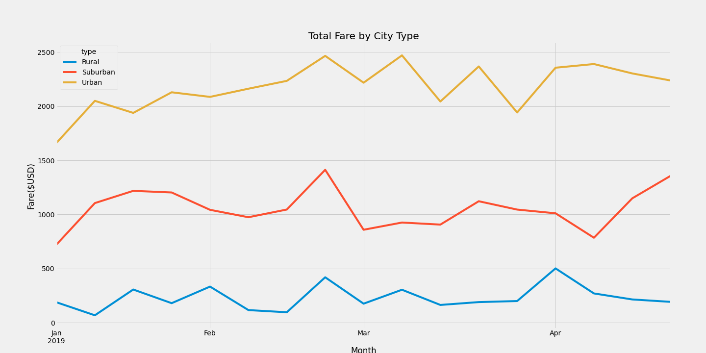

### PyBer_Analysis Overview

Utilizing Python and Pandas, the task was to first sift through and clean PyBer's ride sharing data to prepare for an analysis.  Then, with 
that data, segment it into several data frames, identifying the types of city areas (urban, susburban, rural), obtaining the average cost 
per fare, total fare, driver averages, and constructing a comprehensive final chart, depicting the different ride-sharing in types of areas as
well as comparing fares for the different months of the year.  This summary will allow decision-makers to obtain better predictibility and
possibly look to make improvements to certain aspects of the ride-share program as a result of the data provided.

## Results

Taking all of the 2019 data, I've been able to isolate the different city areas into three regions; urban, suburban and rural.  Within each
of these regions some initial analysis determined that users of the ride share are mosting in the Urban areas.  This may be due to the lack
of parking, the low availability of rental vehicles available, an economical change in automobile purchasing behavior, or maybe that the trend 
is to take ride-share and not spend money on vehicles, gasoline, auto maintenance.  As this trend continues to increase, it will be interesting
to conduct further analysis with more annual data as we've seen in this study.

Upon gathering all of the table data, the first task was to group all of the rides together by city type.  Out of over 2300 rides in the first five months of 2019, we can see that only 5% of rides were in rural areas, 20% in suburban city locations, and the bulk in urban city regions.  Next was to calculate the total amount of drivers and total amount of fares for each city type, so that an average fare could be determined.  Digging further into the data, we could now obtain the average fare per driver for each city type.  The summary to this analysis is depicted below in the PyBer Summary dataframe highlighting the Total Rides, Total Drivers, Total Fares, Average Fare per Ride as well as the Average Fare per Driver.

# Fig.1 - PyBer Summary DataFrame

Each of these data points can provide a better picture into what the expectations may be if PyBer decides to hire more drivers in higher-demand areas or look into providing more economically-fueled vehicles in rural areas (as those rides showed larger fares and longer rides).  Whatever the future brings, it makes sense to look at the past ride data in an attempt to gain insights into the future of ride-sharing.

# Fig.2 - PyBer Fare Summary Line Graph

## Summary and Recommendations
When looking at the PyBer Fare line chart above, it's clear that the most profitable segment is within the urban city limits.  The amount of drivers, the number of fares and the earnings in this region are clearly ahead of the other two.  If there is a limited number of drivers in the Urban areas, especially during peak commute, it may behoove PyBer to think about allowing additional rides in one car.  We want to retain rider loyalty and avoid riders looking to obtain a competitor in the same market.  So with that in mind, maybe allowing for a frequent-rider program to retain brand loyalty.  An additional observation is the peak in rides during March.  Ridership stats are generally lower in the winter months.  Typically at the beginning of the warmer months, the ridership picks up.  An additional recommendation would be to allow for a discount to peak the interest of riders, possibly marketing coupons to current riders via email to entice more riders during those slower months.
